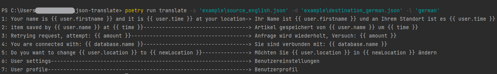

# JSON-Translator
Translate json files ignoring {{ expressions }}.



### Example:
Translate (english): <br>
```json
{
   "profile_user_name": "Your name is {{ user.firstname }} and it is {{ user.time }} at your location"
}
```
To (german): <br>
```json
{
   "profile_user_name": "Ihr Name ist {{ user.firstname }} und an ihrem Standort ist es {{ user.time }}"
}
```
Everything inside {{ expressions }} <ins>won't</ins> get translated.

### Installation:
```
poetry install
```

### Usage:
```commandline
poetry run translate -s 'example\source_english.json' -d 'example\destination_german.json' -l 'german'
```
```[-s]``` Path of source file<br>
```[-d]``` Path of destination file<br>
```[-l]``` Target language to translate to<br>

Use ```[--help]``` to see list of supported languages.
