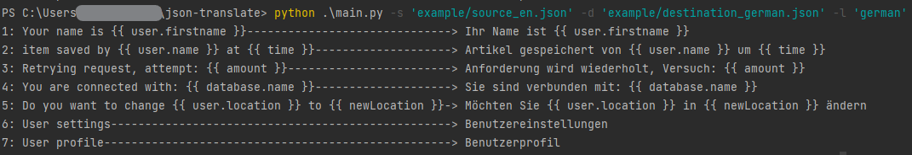

# JSON-Translator
Translate json files ignoring {{ expressions }}.



### Example:
Translate (english): <br>
```json
{
   "profile_user_name": "Your name is {{ user.firstname }}"
}
```
To (german): <br>
```json
{
   "profile_user_name": "Ihr Name ist {{ user.firstname }}"
}
```
Everything inside {{ expressions }} <ins>won't</ins> get translated.

### Usage:
```bash
python main.py -s 'source_en.json' -d 'destination_de.json' -l 'german'
```
```[-s]``` Path of source file<br>
```[-d]``` Path of destination file<br>
```[-l]``` Target language to translate to<br>

Use ```[--help]``` to see list of supported languages.
